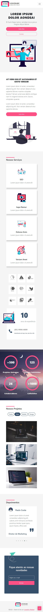

<div align ="center">

# Bootstrap Project

</div>

Projeto desenvolvido em Bootstrap 5, aqui eu utilizei algumas bibliotecas em Javascript para incrementar a aparência do projeto, como as bibliotecas Isotope JS, Owl Carousel e Progress Bar. Para deixar o projeto responsivo eu utilizei Media Queries.

* Demo: [Clique aqui para ver esse projeto](https://leandrorafaeel.github.io/bootstrap-project/)

## Desktop:
<div align="left">
    
</div>

## Mobile:
<div align="left">
    
</div>

## Tecnologias:
Esse projeto foi desenvolvido com as seguintes tecnologias:

* HTML5
* CSS3
* SASS
* Bootstrap 5
* JAVASCRIPT

## Dependências:
Ferramentas que utilizei nesse projeto:

* [Bootstrap 5](https://getbootstrap.com/)
* [SASS](https://sass-lang.com/)
* [JQUERY](https://releases.jquery.com/jquery/)
* [Owl Carousel](https://owlcarousel2.github.io/OwlCarousel2/index.html)
* [Isotope JS](https://isotope.metafizzy.co/)
* [Progress Bar](https://kimmobrunfeldt.github.io/progressbar.js/)

## Como usar:
Clone o repositório abaixo

```
git clone https://github.com/leandrorafaeel/bootstrap-project
```

## Autor: 


#### Leandro Rafael

[](https://www.linkedin.com/in/leandrorafael-dev/) [](https://twitter.com/leandrorafaelBR) 

## Licença:
[](https://opensource.org/licenses/MIT)

Este projeto está sob licença do MIT. Veja a licença para mais informações:

[Veja o Copyright](https://github.com/leandrorafaeel/bootstrap-project/blob/master/LICENSE)